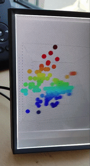

 

# holor Package

A package that creates quilts for holographic images on the Looking Glass Device.

## Supported Plots

As of right now `holor` supports the following functions:

`plot3D::hist3D()` <br>
`plot3D::scatter3D()` <br> 
`plot3D::persp3D()` 


## Install

```{r}
devtools::install_github("DvP17/holor")
```

## Create a quilt

```{r example-quilts}
library(holor)

# Scatter Plot
quilt(plot3D::scatter3D(x = iris$Sepal.Length,
                        y = iris$Petal.Length,
                        z = iris$Sepal.Width),
      cone = 10, theta = 0, phi = 0, device = "LGP", file = "myquilt-scatter.png")

# Histogram
data("VADeaths")
quilt(plot3D::hist3D(z = VADeaths),
      cone = 10, theta = 0, phi = 0, device = "LGP", file = "myquilt-hist.png")

# Perspectives
quilt(plot3D::persp3D(z = volcano, shade = 0.3, col = gg.col(100)),
      cone = 10, theta = 5, phi = 40, device = "LGP", file = "myquilt-persp.png")
```

The `device` argument corresponds to the device you are using to display the hologram. The file name is automatically changed to include information on the parameters needed for HoloPlayStudio.

Now you can export the quilt to HoloPlayStudio with drag & drop.


